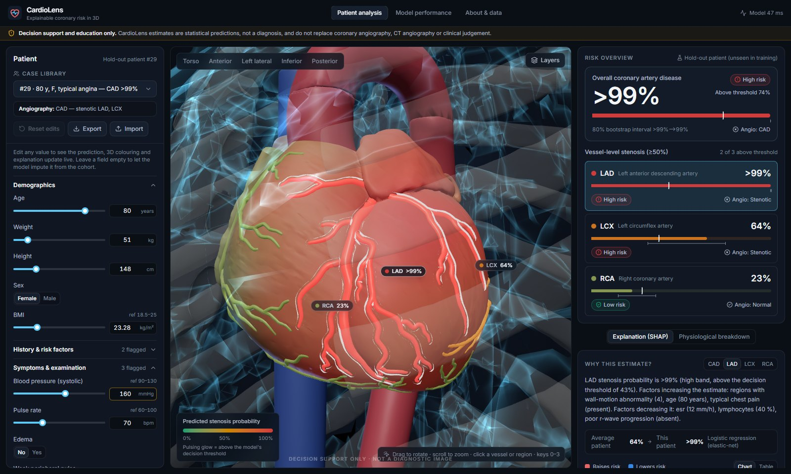
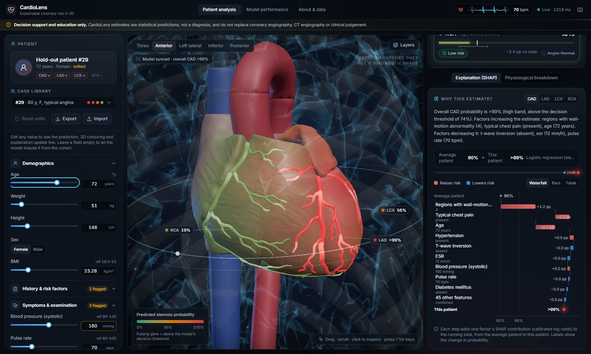
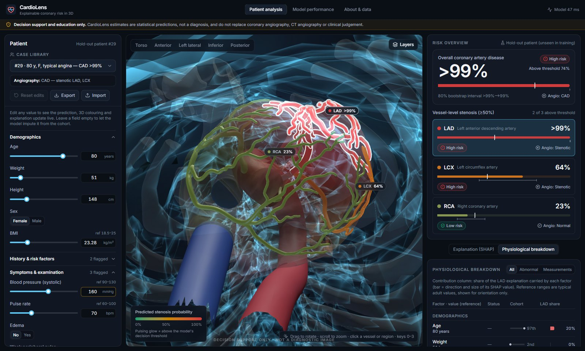
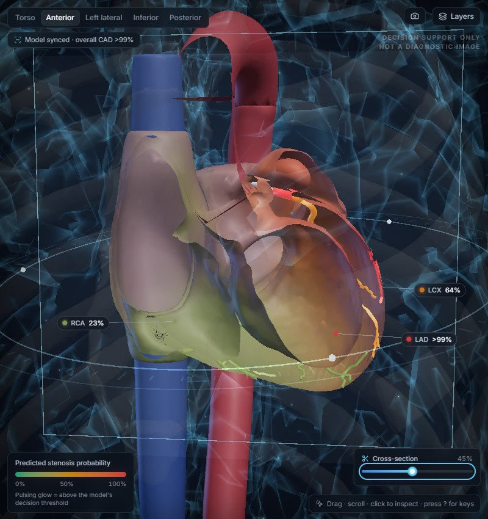
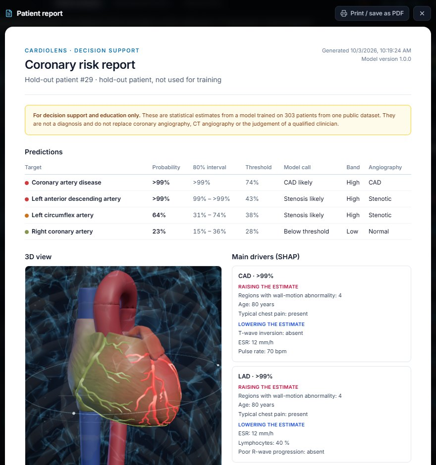
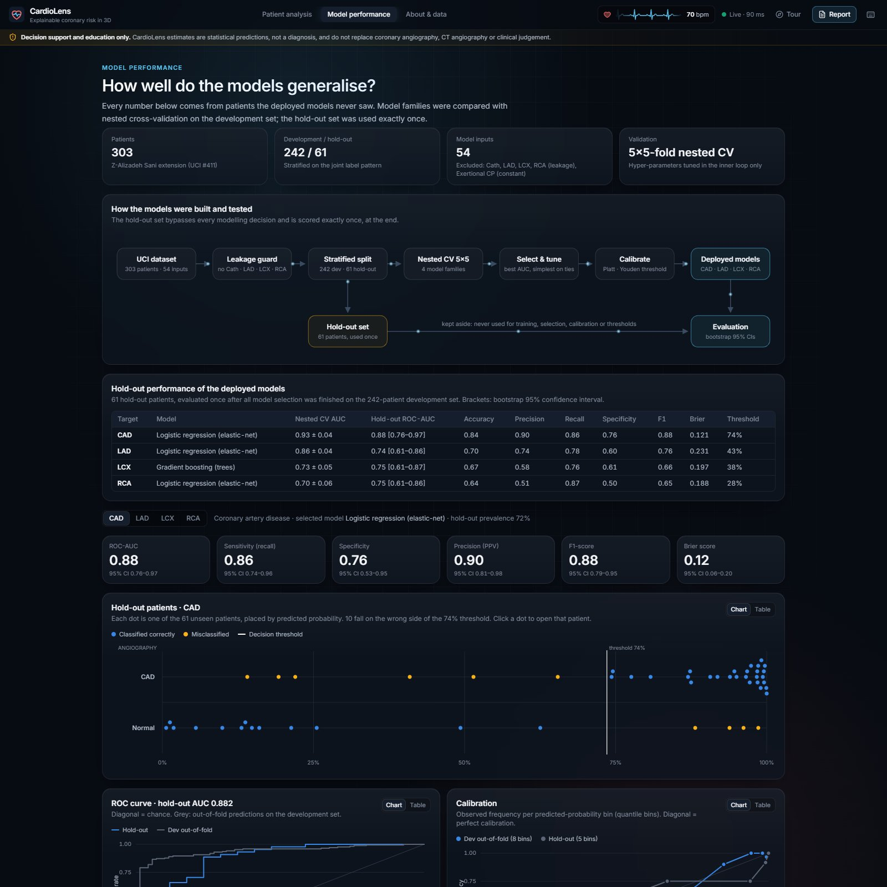
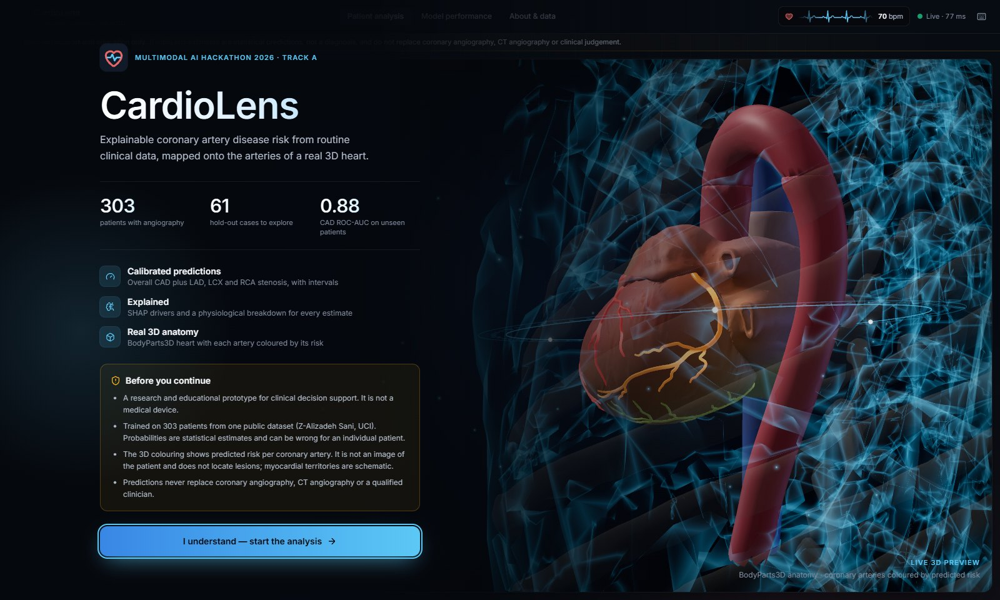
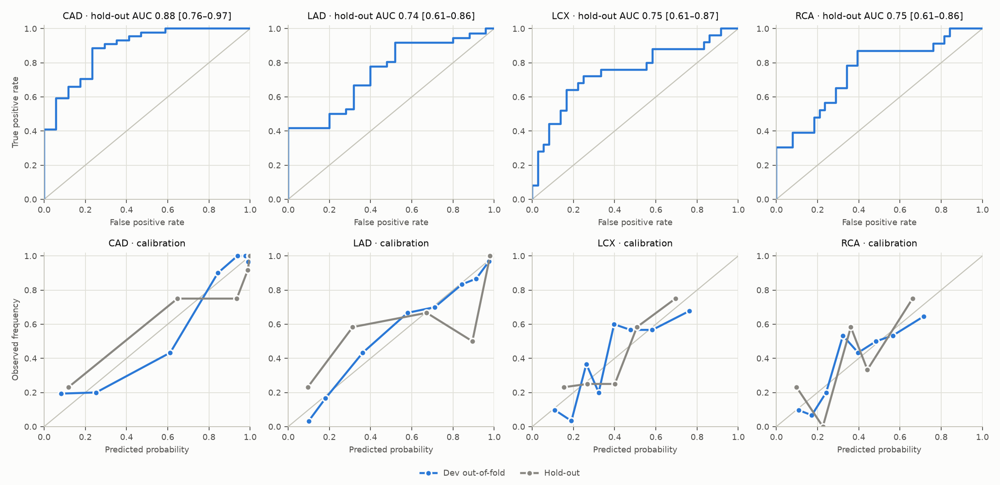

# CardioLens

**Explainable coronary artery disease risk, mapped onto an interactive 3D heart.**

CardioLens predicts overall coronary artery disease (CAD) and significant stenosis
(≥50%) of the **LAD**, **LCX** and **RCA** from routine clinical data. It shows each
prediction on the matching artery of a 3D heart built from real anatomical meshes,
and explains every estimate with SHAP and a physiological breakdown.

> **Clinical safety.** CardioLens is a research and educational prototype for
> decision support. It is not a medical device. Its outputs are statistical
> estimates and do not replace coronary angiography, CT angiography or clinical
> judgement. The UI shows this disclaimer permanently and on first visit.



<p align="center">
  
  
  
  
  
  
</p>

Multimodal AI Hackathon 2026, Track A: Cardiovascular Risk Visualization & Prediction.

---

## Highlights

| | |
|---|---|
| **Prediction** | Four calibrated binary classifiers (CAD, LAD, LCX, RCA). The model family for each target is chosen by 5×5 nested cross-validation, and the models are evaluated once on an untouched 20% hold-out set with bootstrap 95% CIs. |
| **No target leakage** | `Cath`, `LAD`, `LCX` and `RCA` are never inputs. This is enforced in config loading, asserted during training and checked by unit tests against the saved models. |
| **3D anatomy** | Heart, coronary arteries, aorta, venae cavae, cardiac veins, lungs, rib cage and torso from BodyParts3D (FMA-annotated). LAD, LCX and RCA are separate GLB nodes, coloured live by their predicted probability. |
| **Spatial risk mapping** | Hover the myocardium to see which artery supplies that region. The territory is tinted with that artery's risk colour (schematic nearest-artery map). |
| **Interaction** | Orbit, zoom, pan, view presets, click-to-select vessels or myocardial regions, fly-to camera, layer toggles, x-ray mode, and a heartbeat at the patient's recorded pulse. |
| **Explainability** | SHAP values are folded back to clinical features, additive in calibrated log-odds (a unit test checks the additivity). Each prediction gets a text summary and a SHAP waterfall from the average patient to this patient (also as bars and a table). A physiological table lists reference ranges, cohort percentile and each factor's share of the explanation. Global SHAP and permutation importance are shown too. |
| **Real-time** | Any input edit re-scores all four targets with explanations and bootstrap intervals in about 30–40 ms on a laptop CPU. |
| **Visual feedback** | Each new prediction sends a scan band down the myocardium. Emissive pulses run along the arteries at the patient's heart rate, and arteries above their threshold glow (bloom). On the dashboard, numbers ease to new values and changed cards flash with the size of the change. SHAP rows re-order with layout animations, and an ECG strip in the header beats at the patient's pulse. Effects are dropped automatically on slow devices and respect *prefers-reduced-motion*. |
| **Clinical tools** | What-if curves show how each target responds when one factor varies, with the rest fixed. Similar patients come from the training cohort with their angiography results. A printable patient report includes a 3D snapshot. A guided tour, a searchable case library and a cross-section through the heart round out the tools. |
| **Clinical utility** | A decision curve (net benefit against treating all or none) and a subgroup check by sex and age on the hold-out set. |
| **Extensible** | Features (`backend/config/features.yaml`), targets (`targets.yaml`), model families (`models.py`) and 3D structures (`frontend/src/anatomy/registry.ts`) are all declared in configuration. |

## Results

Hold-out set: 61 patients never used for training, model selection, calibration or
threshold choice. Brackets show the bootstrap 95% CI.

| Target | Selected model | Nested CV ROC-AUC (dev) | Hold-out ROC-AUC | Recall | Specificity | F1 | Brier |
|---|---|---|---|---|---|---|---|
| CAD | Elastic-net logistic regression | 0.929 ± 0.039 | **0.88** [0.76–0.97] | 0.86 | 0.76 | 0.88 | 0.121 |
| LAD | Elastic-net logistic regression | 0.860 ± 0.044 | **0.74** [0.61–0.86] | 0.78 | 0.60 | 0.76 | 0.231 |
| LCX | Gradient boosting | 0.735 ± 0.052 | **0.75** [0.61–0.87] | 0.76 | 0.61 | 0.66 | 0.197 |
| RCA | Elastic-net logistic regression | 0.703 ± 0.057 | **0.75** [0.61–0.86] | 0.87 | 0.50 | 0.65 | 0.188 |

- **CAD** is predicted well.
- **LAD** is the most predictable artery.
- **LCX and RCA** remain hard with 303 patients.
- **Baseline.** A logistic regression on eight classic risk factors stays competitive at vessel level. The report discusses this openly.
- **Top SHAP drivers:** typical chest pain, regional wall-motion abnormality and age (CAD, LAD); age and metabolic markers (LCX); diabetes (RCA).

<p align="center">
  
</p>

Full per-target curves, confusion matrices and model comparisons are shown in the
dashboard (**Model performance** tab) and in [`docs/REPORT.md`](docs/REPORT.md).

## Quick start

### Docker (single container, as deployed)

```bash
docker compose up --build
# open http://localhost:7860
```

### Local development

Requirements: Python 3.11+ (3.12 recommended), Node 20+.

```bash
# 1) API
cd backend
python -m venv .venv
. .venv/bin/activate            # Windows: .venv\Scripts\activate
pip install -r requirements-dev.txt
uvicorn cardiolens.api.main:app --reload --port 8000

# 2) Dashboard (second terminal)
cd frontend
npm install
npm run dev                      # http://localhost:5173 (proxies /api to :8000)
```

The trained model weights are committed in `backend/artifacts/`, so the app runs
without retraining.

### Reproduce the models

```bash
cd backend
python -m cardiolens.train        # ~55 min on 8 cores (5x repeated nested CV, 4 families x 4 targets)
python -m cardiolens.train --quick   # smoke test, fewer folds and families
python -m cardiolens.report       # Markdown tables from artifacts/metrics.json
python -m cardiolens.train --explain-only   # recompute SHAP importance + figures from saved models
pytest                            # 20 tests: data, leakage, SHAP additivity, train/serve parity, what-if, similarity, API
```

The pipeline downloads the UCI dataset if the committed copy is missing. It is
fully seeded (`SEED = 42`).

### Rebuild the 3D anatomy (optional)

```bash
pip install -r backend/requirements-anatomy.txt
python anatomy/build_heart_glb.py   # downloads ~170 MB of BodyParts3D STL once, writes frontend/public/models/heart.glb
```

## Architecture

```
            ┌──────────────────── React 19 + TypeScript (Vite) ─────────────────────┐
            │ Patient panel ── zustand store ── debounced POST /api/predict (140 ms) │
            │      │                 │                                               │
            │ 3D viewer (React Three Fiber, BVH picking)   Risk · SHAP · Physiology  │
            │  heart.glb nodes ⇄ anatomy/registry.ts ⇄ target ids ⇄ model outputs    │
            └──────────────────────────────┬─────────────────────────────────────────┘
                                           │ JSON
            ┌──────────────────────────────▼──────────── FastAPI ────────────────────┐
            │ /api/schema  /api/cases  /api/metrics  /api/importance  /api/predict  │
            │ Predictor: encode → impute → pipeline → Platt → SHAP → bootstrap CI    │
            └──────────────────────────────┬─────────────────────────────────────────┘
                                           │ joblib artifacts
            ┌──────────────────────────────▼──────────── Training ───────────────────┐
            │ UCI xlsx → features.yaml encoding → stratified 80/20 split             │
            │ nested CV (LR / GB / RF / SVM) → select → tune → OOF → Platt + Youden  │
            │ hold-out metrics + bootstrap CIs → SHAP + permutation importance        │
            └───────────────────────────────────────────────────────────────────────┘
```

| Path | Contents |
|---|---|
| `backend/cardiolens/` | `data.py` (loading/encoding), `features.py` (preprocessing, schema), `models.py` (model registry), `evaluation.py` (nested CV, calibration, CIs), `explain.py` (SHAP), `train.py`, `predictor.py`, `api/` |
| `backend/config/` | Feature catalogue and target definitions (YAML) |
| `backend/artifacts/` | Trained weights (`models/*.joblib`), `metrics.json`, `importance.json`, `schema.json`, `cases.json` |
| `anatomy/build_heart_glb.py` | Reproducible BodyParts3D → GLB pipeline (orientation, decimation, territory weights) |
| `frontend/src/` | Dashboard: `components/viewer` (3D), `risk`, `explain`, `physiology`, `patient`, `model` |
| `docs/` | Project report (≤6 pages), demo video script, figures |
| `deploy/` | Render blueprint and Hugging Face Spaces card |

### API

| Method | Path | Description |
|---|---|---|
| GET | `/api/health` | Status and loaded models |
| GET | `/api/schema` | Feature groups, types, units, ranges, reference intervals and cohort statistics; targets and their 3D structure ids |
| GET | `/api/cases` | The 61 hold-out patients with angiography ground truth |
| GET | `/api/metrics` | Full evaluation report |
| GET | `/api/importance` | Global SHAP and permutation importance |
| POST | `/api/profile` | `{"features", "feature"}` → probability of every target across the factor's range (what-if curve) |
| POST | `/api/similar` | `{"features", "k"}` → the most similar development patients with their angiography results |
| POST | `/api/predict` | `{"features": {...}}` → probabilities, intervals, thresholds, SHAP contributions, text summaries, physiology rows. Missing features are imputed. |

Interactive docs: `/docs` (Swagger UI).

## Extending CardioLens

- **New clinical feature:** add an entry to `backend/config/features.yaml` and retrain. The form, schema, SHAP and physiology table pick it up automatically.
- **New prediction target:** add it to `backend/config/targets.yaml`, add a node to the GLB (or reuse one) and map it in `frontend/src/anatomy/registry.ts`.
- **New model family:** register it in `backend/cardiolens/models.py` with a hyper-parameter grid and explainer type. Nested CV then considers it automatically.
- **New anatomical structure:** add FMA ids to `PARTS` in `anatomy/build_heart_glb.py` and a `StructureDef` in the registry.

## Deployment

- **Hugging Face Spaces:** Docker SDK, port 7860. See `deploy/huggingface/README.md`.
- **Render:** `deploy/render.yaml` blueprint (Docker runtime; `$PORT` is honoured).
- Any container host: `docker build -t cardiolens . && docker run -p 7860:7860 cardiolens`.

## Data, anatomy and licenses

- Code: MIT (`LICENSE`).
- Dataset: *Extension of Z-Alizadeh Sani* (UCI #411), CC BY 4.0.
- 3D meshes: BodyParts3D © DBCLS, CC BY-SA 2.1 JP (the derived `heart.glb` keeps this license).

Details and citations: [`THIRD_PARTY_NOTICES.md`](THIRD_PARTY_NOTICES.md).
